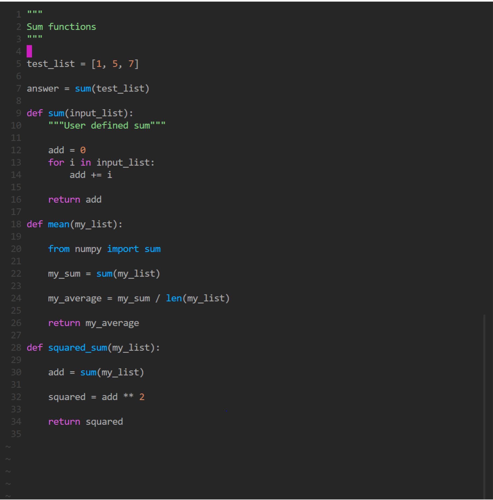

# Week 6 Discussion  

This week's discussion focuses on Python namespaces and scope and gives additional practice with Python data types. 
If you finish those exercises, you will also have the opportunity to learn about the [Python Collections module](https://docs.python.org/3/library/collections.html).

For today's discussion, you should report your responses in our shared google slide presentation. 
Each group should have their own slide (or slides) for answers.

[Shared Slides](https://docs.google.com/presentation/d/1vUC8IcIsuEvxJnQM-_XnFBBzIOJFAgC8yB1HZ4kX1Qc/edit?usp=sharing)

## ICE BREAKER!
What is your hometown famous for? (you can share on the Google Slide if you want!)

## Namespaces and Scope

For this exercise, you are asked to read and interpret code without executing it. Being able to read and comprehend code will be crucial to you as you become a better software developer.

Write your answers in a `README.md` file.  

1. Define `namespace` and `scope` for the Python programming language. In what namespace order does Python search for names?

1. Consider the code shown in this image and answer the questions below the image.



1. How many versions of the `sum` function are used in this code sample? What are they?

1. For each version of the sum function, write the line or lines where it is called.

1. What is the scope of the variable `add`?

1. What is the scope(s) of the variable `my_list`?

1. What is the namespace of `test_list`?

1. What is the namespace of `my_list`?

1. Consider that the following code is added. Write what the output number will be, and trace the execution of the code. Write, in order, the line numbers that will be executed to evaluate this task. **Share your line numbers** in the shared 

```python
mean( [ squared_sum([1, 4, 5]), sum(test_list) ] )
```

If you want to check yourself, you can type the code into [Python Tutor](https://pythontutor.com/).

## Bash Scripting and Python Data Types

Using an appropriate command line tool, retrieve the Python file at this URL. **Share your approach** in the shared Google Slides presentation. 

https://gist.githubusercontent.com/janash/4fc7cdff99e2e7dcfea8315b98c2ec65/raw/4a1e77e373e3516cb71701c3c700e48073788751/thermo.py

This file contains some thermodynamic data.

Perform the following tasks using only the Python Standard Library built-in functions and data types. 
This means you may not import any modules to complete these tasks.

First, discuss each task with your group. 
How can you use features of Python data types to perform each task? Save your code in a file exercises.py, making sure to label each task.

1. Find the unique substances in all_substances. **Share your approach** (not your code) in the shared Google Slides Presentation.
2. Count the number of times each unique substance occurs in all_substances. Save this in a dictionary where the keys are the substance and the values are the number of times each occurred. **Share your approach** (not your code) in the shared Google Slides Presentation.
3. Using the dictionary `deltaH`, collect all the substances (keys) which are in the solid state (this means the formula is followed by `(s)`). **Share your approach** (not your code) in the shared Google Slides Presentation.

**Challenge** - Do tasks 2 and 3 using comprehensions.

**Challenge** - Write a Python script which performs this task using the smallest number of lines you can. Put your answer in the shared Google Doc. Do you think writing the code this way is a good idea? Why or why not?

After you have completed your tasks, write a bash script completes all the tasks. Your script should:

1. Download and save the file containing data.
2. Complete and prints the answers to the above task to a file.

### Python Collections
The Python [collections module](https://docs.python.org/3/library/collections.html) provides specialized container datatypes, enhancing the default ones like lists and dictionaries.
Review the documentation for the collections module and identify if any of the data structures could have been used to acheive the tasks above.
Share your findings in the Shared Slides Presentation.


  